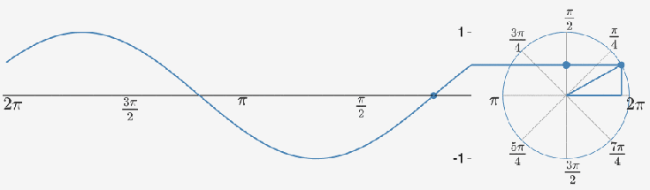

# Graphear

Graphear is a small Python application that allows you to hear 2D graphs. The program samples a target function across a range of `x` values, converts the valid `y` values into audio frequencies, and then animates a moving point along the graph while the generated audio plays in sync.

## Features

- Synchronizes sound playback with an animated point on the graph
- Smooths sound transitions using continuous phase accumulation to avoid clicking artifacts
- Interpolates frequencies so the sound changes gradually instead of jumping between values
- Handles problematic values such as `NaN`, `0/0`, shape mismatches, and large asymptote spikes
- Supports normal 2D functions, horizontal lines, and simple vertical lines
- Keeps the program running when a function produces no valid data by showing a fallback screen instead of crashing
- Uses actual audio stream timing (including latency) to keep the animation and sound in sync

## Main Dependencies

This project mainly depends on:

- `numpy` for numeric arrays, sampling, normalization, and waveform generation
- `matplotlib` for drawing the graph and running the animation
- `sounddevice` for real-time audio playback

## Quick Start

These steps are written for Windows. After cloning this repository to your device, open it in an IDE (e.g. VSCode) and type these commands in the terminal:

### 1. Create a virtual environment

```powershell
py -m venv .venv
```

### 2. Activate the virtual environment

```powershell
.\.venv\Scripts\Activate.ps1
```

If the script execution is blocked, run:

```powershell
Set-ExecutionPolicy -Scope CurrentUser RemoteSigned
```

Then activate the environment again.

### 3. Install dependencies

```powershell
pip install -r requirements.txt
```
Make sure the 2 files, `requirements.txt` and `graphear.py`, are in the same directory.

### 4. Choose function

Choose one of the built-in 2D mathematical functions or insert your own:
```python
def target_function(x):
    return np.sin(x)
    ...
```

You can replace this with other functions to create different visual and audio patterns. For instance, you can use NumPy's `where` function to create conditions:

```python
# Creates a gap in the center
return np.where(np.abs(x) < 1, np.nan, np.sin(x))
```

You can also test a vertical line with:

```python
def target_function(x):
    return ("vertical", 3)
```

### 5. Run the program

```powershell
py graphear.py
```

When the window opens, the graph will appear and the generated sound will begin when the animation starts.

## How The Program Works

In simple terms, Graphear works like this:

1. `target_function(x)` Read a mathematical function.

2. `_evaluate_target_function(self, x_values)` Run the function safely and handle direct errors.

3. `_validate_y_values(self, y_values)` Ensure the function returns one value per input.

4. `_prepare_data(self)` Sample points, validate the output, handle vertical lines, and remove invalid values.

5. `_use_no_plot_fallback(self, x_values)` Safely halt calculation and prep an error screen if the data is totally unusable.

5. `normalize(arr, new_min, new_max)` Scale the clean values into a usable frequency range.

6. `generate_audio(freqs, sample_rate, duration)` Convert cleaned graph values into frequencies.

7. `_generate_audio_sequence(self)` Build one smooth audio signal from those frequencies.

8. `_setup_plot(self)` Draw the graph or show a fallback message if no valid data exists.

9. `play(self)` Start playback.

10. `update(self, frame)` Move the point based on real audio playback timing.

## Input Validation And Error Handling

Graphear has an explicit validation path so different kinds of bad input are handled in different ways:

* If the function raises a direct arithmetic error (such as `0/0`), `_evaluate_target_function()` catches it and returns an array of `NaN` values instead of crashing the program.

* If the function returns values with the wrong shape (not one `y` value per `x`), `_validate_y_values()` raises a `ValueError` to prevent mismatched graph and audio data.

* If the function returns a vertical line tuple like `("vertical", value)`, the program builds a vertical line instead of a normal `y = f(x)` graph.

* If the vertical line position is not a finite number, the program switches to a safe fallback state instead of attempting to plot invalid data.

* After evaluation, very large values (such as asymptote spikes) are replaced with `NaN` so they are not plotted or converted into sound.

* If every point becomes invalid after cleanup, `_use_no_plot_fallback()` is activated. The program stays open, displays a message, and avoids generating misleading audio.

* If the function raises any other unexpected error during evaluation, the program treats it as invalid input and falls back safely instead of crashing.

* If no valid frequencies are produced, the audio generation step returns an empty (silent) audio array instead of failing.

## State Machine Diagram


## Function And Method Breakdown

### `target_function(x)`

This is the mathematical function the program will visualize and sonify. The default is:

```python
return np.sin(x)
```

You can replace this with other functions to create different visual and audio patterns.

You can also use:

```python
return ("vertical", 3)
```

to test the vertical line `x = 3`.

### `AudioVisualizer`

This class declares the initial state of the program. 

It sets the `sample_rate` to 44100, which means the sound is cut into 44,100 data slices (samples) played per second, which is also the standard for CDs. This rate determines the smoothness of the sound; the higher the sample rate, the smoother the audio will be.

It also sets each point on the graph to run for a duration of 0.005 seconds (5ms), meaning each point contains roughly 220.5 audio samples. This duration determines the running speed of the graph: the lower the duration, the faster the animation runs. 

Finally, it prepares the numeric data `_prepare_data()`, converts it to sound `_generate_audio_sequence()`, and sets up the plot `_setup_plot()`.

### `_prepare_data()`

The goal here is to get 2 arrays (`x` and `y`) of the points that need to produce sound. 

First, the mathematical function is received, and we preset an array of 2000 numbers, spread evenly in the range from -15 to 15.

Then, we pass each `x` value into the function to calculate `y`, meaning `y` is also an array of 2000 numbers. This step now goes through `_evaluate_target_function()`, which catches direct division-by-zero cases such as `0/0` and converts them into `NaN` values.

If the function returns `("vertical", value)`, the program builds a vertical line instead. In that case, all `x` values are set to that one value, and the `y` values run from -15 to 15.

Next, we eliminate outliers (like asymptote spikes). We find any `y` elements with an absolute value greater than 10 and assign them as `np.nan` (which stands for "Not a Number" in Python). 

Finally, we filter out these `NaN` values by moving the valid numbers to a clean, new array for audio mapping.

If every point becomes invalid at any point during this process, the program calls `_use_no_plot_fallback()` to switch into the safe state.

### `_evaluate_target_function()`

This method runs the user-supplied function inside a `try` block.

If the function contains a direct arithmetic error like:

```python
return np.full_like(x, 0 / 0)
```

Graphear catches that general `Exception` before the program crashes and returns an array of np.nan values instead.

### `_validate_y_values()`

This method checks whether the function output can be treated as graph data.

- If the output shape is wrong, it raises an `ValueError`.
- If the output is fully undefined (`NaN` or infinity everywhere), it passes that result forward so `_prepare_data()` can switch into the safe fallback path instead of crashing immediately.
- If the output is usable, it returns the numeric array normally.

### `_use_no_plot_fallback(self, x_values)`

This method sets a safe fallback state when the input function fails to produce any usable graph data (for instance, if the function returns only `NaN` values or causes a shape mismatch).

Instead of crashing, it sets `has_plot_data = False`, fills the `y` array with `NaN`s to prevent plotting, and sets safe default coordinates for the animation point. This allows the program's window to open normally and display a helpful "No valid graph points" message to the user, without attempting to play audio or animate a non-existent curve.

### `_generate_audio_sequence()`

After we've obtained the clean coordinates of the points (free of `NaN`s), we want to generate its audio sequences. This basically turns each of the cleaned `y` values of your function into values to make sound (frequencies) and then generates the audio array from them.

In this code, we normalize the clean `y` values into a frequency range of 150 Hz to 1000 Hz.

### `normalize(arr, new_min, new_max)`

Since we are technically mapping an old range into a new range, we use a mathematical algorithm known as [Min-Max Normalization](https://apxml.com/courses/intro-feature-engineering/chapter-4-feature-scaling-transformation/normalization-scaling) to scale a range to an arbitrary range [a,b]:

> $$ X_{\text{scaled}} = a + \frac{(X - X_{\min})(b - a)}{X_{\max} - X_{\min}} $$
> 
> - $X$ is the original feature value.
> 
> - $X_{\min}$ is the minimum value observed for that feature in the training data.
> 
> - $X_{\max}$ is the maximum value observed for that feature in the training data.

It also includes a crucial safety check: if `arr_max` and `arr_min` are the exact same number (meaning your graph is just a straight horizontal line), `arr_max - arr_min` equals 0. If you didn't have this `if` statement to handle the flatline, the formula below it would try to divide by zero, which would instantly crash your entire program.

### `generate_audio(freqs, sample_rate, duration)`

This method creates the full audio signal from the frequencies.

First, it spreads the frequencies smoothly across the whole sound timeline:

```python
source_positions = np.arange(len(freqs))
target_positions = np.linspace(0, len(freqs) - 1, total_samples)
smooth_freqs = np.interp(target_positions, source_positions, freqs)
``` 

This basically uses [Linear Interpolation](https://web1.eng.famu.fsu.edu/~dommelen/courses/eml3100/aids/intpol/) to estimate values between 2 known points:

> For a time $t$ falling between two original indices $i$ and $i+1$, the interpolated frequency $f(t)$ is:$$f(t) = f_i + (t - i) \cdot \frac{f_{i+1} - f_i}{(i+1) - i}$$
>
> * $f_i$: The frequency at the starting known point.
>
>* $(t - i)$: How far we have moved into the gap between the two points.
>
>* $\frac{f_{i+1} - f_i}{(i+1) - i}$: The Slope (Rate of Change). In Graphear, the denominator is $1$ because `source_positions` increments by 1.

Then, it builds one [continuous sine wave](https://mathematicalmysteries.org/sine-wave/):

``` python
phase = (2 * np.pi * np.cumsum(smooth_freqs) / sample_rate)
wave = 0.2 * np.sin(phase)
```

using these following formulas:
> $$\Phi_n = \frac{2\pi}{f_s} \sum_{k=0}^{n} f_k$$
>
> * $2\pi$: Converts "rotations" into Radians. One full wave cycle is $2\pi$ radians.
>
> * $\sum_{k=0}^{n} f_k$ (np.cumsum): This is the Accumulated Frequency. It tracks the "total distance" the wave has traveled. Without this, the wave would "reset" every time the frequency changes, causing loud popping noises.
>
> * $f_s$ (sample_rate): Normalizes the calculation so it accounts for time (44,100 samples = 1 second).

and 

> $$y(t) = A \cdot \sin(\Phi_t)$$
> * $A$ (0.2): The Amplitude. This controls the volume. $1.0$ is the maximum volume; $0.2$ is a safe, comfortable level.
>
> * $\sin$: The function that converts the accumulated phase into a smooth oscillation between $-1$ and $1$.



After that, it applies a fade-in and fade-out envelope so the sound starts and ends smoothly.

```python
fade[:edge_size] = np.linspace(0, 1, edge_size)  # Fade in
fade[-edge_size:] = np.linspace(1, 0, edge_size) # Fade out
wave = wave * fade
```
using Linear Envelope concept:

> $$y_{final}(t) = y_{wave}(t) \times E(t)$$
>
> * $E(t)$: The envelope value.
>
>   * At the start: It goes from $0.0 \to 1.0$ so the sound starts at silence and grows.
>   * At the end: It goes from $1.0 \to 0.0$ so the sound "fades" to silence.

The result is one stereo NumPy array with the same sound sent to both ears, and it can be played by `sounddevice`.

### `_setup_plot()`

This method handles all the visuals:

- applies a clean matplotlib style
- creates the figure and axes
- labels the axes
- draws the grid and axis lines
- plots the full function
- creates a red marker point that will move during playback
- displays a message when the current input has no valid graph points
- connects the window close event to `sd.stop()` so audio stops when the window closes

### `play()`

This method starts the full experience:

- creates a `FuncAnimation`
- repeatedly calls `update(frame)`
- opens the matplotlib window with `plt.show()`

### `update(frame)`

This is the animation callback that runs constantly to keep the audio and visuals in perfect sync.

If the current input produced no plottable data, the method returns immediately and leaves the empty graph message in place.

On its very first update, it starts the audio playback and reads timing information from the audio stream itself.

On every frame after that, it measures the elapsed time, divides it by the duration per point (0.005s) to find the current sample index, and moves the red point to the matching `(x, y)` coordinate.

## Future Improvement Ideas

- Allow users to choose functions from a menu
- Add keyboard controls for pause, restart, or speed changes
- Separate audio generation, plotting, and function processing into multiple classes
- Add tests for normalization and data-cleaning behavior
- Export generated audio to a file


