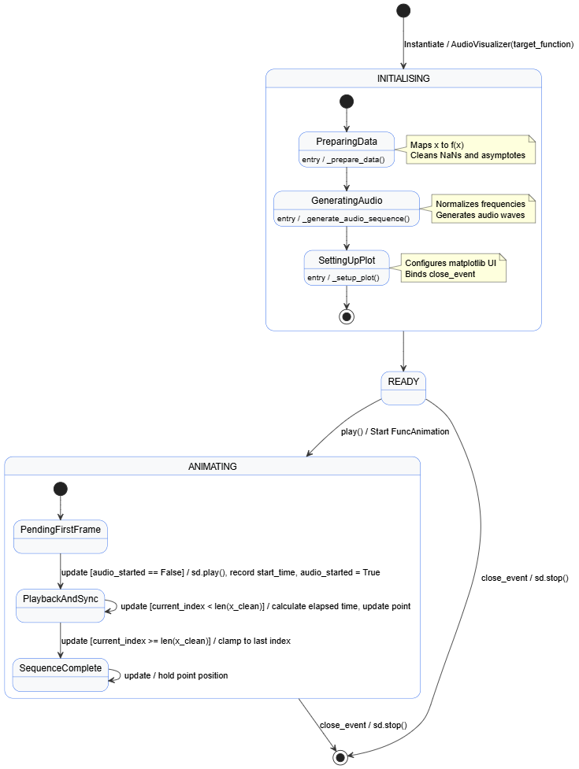

# Graphear

Graphear is a small Python application that allows you to hear any 2D graphs. The program samples a target function across a range of `x` values, converts the valid `y` values into audio frequencies, and then animates a moving point along the graph while the generated audio plays in sync.

## Features

- Synchronizes sound playback with an animated point on the graph
- Handles problematic values such as `NaN` and large asymptote spikes

## Main Dependencies

This project mainly depends on:

- `numpy` for numeric arrays, sampling, normalization, and waveform generation
- `matplotlib` for drawing the graph and running the animation
- `sounddevice` and `time` for real-time audio playback

## Quick Start

These steps are written for Windows. After cloning this repository to your device, open it in an IDE (e.g. VSCode) and type these commands in the terminal:

### 1. Create a virtual environment

```powershell
py -m venv .venv
```

### 2. Activate the virtual environment

```powershell
.\.venv\Scripts\Activate.ps1
```

If the script execution is blocked, run:

```powershell
Set-ExecutionPolicy -Scope CurrentUser RemoteSigned
```

Then activate the environment again.

### 3. Install dependencies

```powershell
pip install -r requirements.txt
```
Make sure the 2 files, `requirements.txt` and `graphear.py`, are in the same directory.

### 4. Choose function

Choose one of the built-in 2D mathematical functions the or insert your own: 
```python
def target_function(x):
    return np.sin(x**2)  # wowowowowowowowowow
    ...
```

### 5. Run the program

```powershell
py graphear.py
```

When the window opens, the graph will appear and the generated sound will begin when the animation starts.

## How The Program Works

In simple terms, Graphear works like this:

1. `target_function(x)` Read a mathematical function.
2. `_prepare_data(self)` Sample many points from that function.
3. `normalize(arr, new_min, new_max)` Clean the data so invalid values do not break the result. 
4. `generate_audio(freqs, sample_rate, duration)` Convert the function values into sound frequencies.
5. `_generate_audio_sequence(self)` Build one long audio signal.
6. `_setup_plot(self)` Draw the graph.
7. `play(self)` Start playback.
8. `update(self, frame)` Move a point along the curve so the user can both see and hear the function at the same time.

## State Machine Diagram



## Function And Method Breakdown

### `target_function(x)`

This is the mathematical function the program will visualize and sonify. The default is:

```python
return np.sin(x**2)
```

You can replace this with other functions to create different visual and audio patterns.

### `AudioVisualizer`

This class declares the initial state of the program. 

It sets the `sample_rate` to 44100, which means the sound is cut into 44,100 data slices (samples) played per second, which is also the standard for CDs. This rate determines the smoothness of the sound; the higher the sample rate, the smoother the audio will be.

It also sets each point on the graph to run for a duration of 0.005 seconds (5ms), meaning each point contains roughly 220.5 audio samples. This duration determines the running speed of the graph: the lower the duration, the faster the animation runs. 

Finally, it prepares the numeric data `_prepare_data()`, converts it to sound `_generate_audio_sequence()`, and sets up the plot `_setup_plot()`.

### `_prepare_data()`

The goal here is to get 2 arrays (`x` and `y`) of the points that need to produce sound. 

First, the mathematical function is received, and we preset an array of 2000 numbers, spread evenly in the range from -15 to 15. 

Then, we pass each `x` value into the function to calculate `y`, meaning `y` is also an array of 2000 numbers.

Next, we eliminate outliers (like asymptote spikes). We find any `y` elements with an absolute value greater than 10 and assign them as `np.nan` (which stands for "Not a Number" in Python). 

Finally, we filter out these `NaN` values by moving the valid numbers to a clean, new array for audio mapping.

### `_generate_audio_sequence()`

After we've obtained the clean coordinates of the points (free of `NaN`s), we want to generate its audio sequences. This basically turns each of the cleaned `y` values of your function into values to make sound (frequencies) and then generates the audio array from them. 

In this code, we normalize the clean `y` values into a frequency range of 150 Hz to 1000 Hz.

### `normalize(arr, new_min, new_max)`

Since we are technically mapping an old range into a new range, we use a mathematical algorithm known as [Min-Max Normalization (or Linear Interpolation/Scaling)](https://apxml.com/courses/intro-feature-engineering/chapter-4-feature-scaling-transformation/normalization-scaling).

It also includes a crucial safety check: if `arr_max` and `arr_min` are the exact same number (meaning your graph is just a straight horizontal line), `arr_max - arr_min` equals 0. If you didn't have this `if` statement to handle the flatline, the formula below it would try to divide by zero, which would instantly crash your entire program.

### `generate_audio(freqs, sample_rate, duration)`

This method creates the full audio signal from the frequencies. 

For each frequency, it creates a short time slice based on the duration and generates a tiny sine wave.

Crucially, it applies an `envelope` to soften the sound. Multiplying the wave by the envelope smoothly fades the tiny sound clip in and out, which stops the final audio from making harsh, ugly clicking noises when thousands of points are glued together. 

The result is one continuous NumPy array that can be played by `sounddevice`.

### `_setup_plot()`

This method handles all the visuals:

- applies a clean matplotlib style
- creates the figure and axes
- labels the axes
- draws the grid and axis lines
- plots the full function
- creates a red marker point that will move during playback
- connects the window close event to `sd.stop()` so audio stops when the window closes

### `play()`

This method starts the full experience:

- creates a `FuncAnimation`
- repeatedly calls `update(frame)`
- opens the matplotlib window with `plt.show()`

### `update(frame)`

This is the animation callback that runs constantly to keep the audio and visuals in perfect sync.

On its very first update, it starts the audio playback and starts a stopwatch (`time.perf_counter()`). 

On every frame after that, it measures the elapsed time, divides it by the duration per point (0.005s) to find the current sample index, and moves the red point to the matching `(x, y)` coordinate.

## Future Improvement Ideas

- Allow users to choose functions from a menu
- Add keyboard controls for pause, restart, or speed changes
- Separate audio generation, plotting, and function processing into multiple classes
- Add tests for normalization and data-cleaning behavior
- Export generated audio to a file


